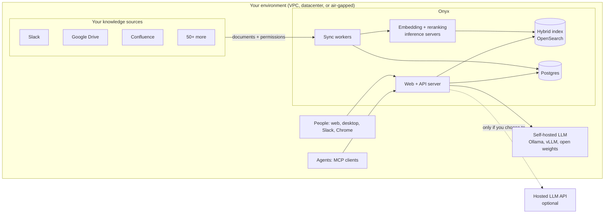

<a name="readme-top"></a>

<h2 align="center">
    <a href="https://www.onyx.app/?utm_source=onyx_repo&utm_medium=github&utm_campaign=readme"> </a>
</h2>

<p align="center">
    <a href="https://discord.gg/TDJ59cGV2X" target="_blank">
        
    </a>
    <a href="https://docs.onyx.app/?utm_source=onyx_repo&utm_medium=github&utm_campaign=readme" target="_blank">
        
    </a>
    <a href="https://www.onyx.app/?utm_source=onyx_repo&utm_medium=github&utm_campaign=readme" target="_blank">
        
    </a>
    <a href="https://github.com/onyx-dot-app/onyx/blob/main/LICENSE" target="_blank">
        
    </a>
</p>

<p align="center">
  <a href="https://trendshift.io/repositories/12516" target="_blank">
    
  </a>
</p>

<p align="center">
  <b>English</b> | <a href="./README.zh-CN.md">简体中文</a>
</p>

# Onyx: Complete Context for Your Humans and Agents

**[Onyx](https://www.onyx.app/?utm_source=onyx_repo&utm_medium=github&utm_campaign=readme)** gives your people and your agents the best context from your company's knowledge, without any data leaving your environment.

> [!TIP]
> Deploy with a single command:
>
> ```
> curl -fsSL https://onyx.app/install_onyx.sh | bash
> ```


---

## What is Onyx?

Onyx connects to the tools your company already works in (Slack, Google Drive, Confluence, Jira, GitHub, Salesforce, and 50+ more), indexes them continuously, and answers questions with citations. The same context is available to people in chat and to agents over MCP.

Most AI tools search one app at a time and hand the model whatever comes back first. Onyx indexes everything up front, sends your question out in several forms, and assembles the answer from every source that matters. That is the difference between "no anomaly stands out" and "the $40K is the perf-test cluster from PR #2213 that nobody tore down."

Because the context comes from a pre-built hybrid index instead of a chain of live app searches, answers arrive faster and use fewer tokens.

The search quality is measured, not asserted:

- On [EnterpriseRAG-Bench](https://www.onyx.app/enterpriserag-bench?utm_source=onyx_repo&utm_medium=github&utm_campaign=readme), our open source benchmark of 500 questions over real workplace data, Onyx outperforms Azure AI Search, OpenAI File Search, and Vertex AI Search.
- On 99 real workplace questions across 220K internal documents, scored blind by two independent LLM judges, Onyx wins the [head-to-head](https://www.onyx.app/answers?utm_source=onyx_repo&utm_medium=github&utm_campaign=readme) against the leading enterprise AI products.

---

## How is Onyx the most secure, and why should I care?

Every enterprise AI product asks you to ship your documents, your embeddings, and your prompts to someone else's cloud. Once that happens you are trusting a vendor's retention policy, a vendor's access controls, and a vendor's training terms. Onyx removes the vendor from that sentence.

### Onyx runs entirely in your environment

Deploy Onyx in your own cloud account, in your own datacenter, or fully air-gapped. Every component runs inside the boundary your security team already owns. Your documents, embeddings, and prompts never leave it. The only outbound call Onyx makes on its own is anonymous usage telemetry, and one env var (`DISABLE_TELEMETRY=true`) turns that off.



What this means in practice:

- **Documents and embeddings stay in your infrastructure.** The index, the database, and the embedding models all run on machines you control.
- **No training on your data, by anyone, ever.** There is no Onyx cloud in the loop that could retain or learn from your content. Anonymous telemetry carries version, event types, and timing data, never document or prompt content. Sentry and PostHog are off unless you set their keys.
- **Model traffic is your decision.** Point Onyx at a self-hosted model and no token ever leaves your network. Or use a hosted API provider under your own contract and keys. Either way, Onyx never proxies your prompts through a third party.
- **Audit everything.** Query history records who asked what and which documents were cited. [Audit logging](docs/AUDIT_LOGGING.md) records logins, admin changes, and access-control changes for your SIEM.

### Open source

The full Community Edition is MIT licensed and in this repository. Your security team can read the code that touches your data, build the images themselves, and verify there is no hidden egress. You do not have to take our word for any claim on this page.

### Any model

Onyx is not tied to a model vendor. Run open weights on your own GPUs through Ollama, vLLM, or LiteLLM. Connect Anthropic, OpenAI, Gemini, or any other provider under your own account. Swap providers in one click, or route each team to a different model. When a better model ships, or when your compliance requirements change, you move without re-platforming.

### Permission syncing

Search is only safe if it respects the permissions your sources already enforce. Onyx syncs document-level access controls from Google Drive, Confluence, Jira, GitHub, Slack, SharePoint, Gmail, Outlook, Teams, Zoom, Box, and Canvas, and filters Salesforce results live against the source at query time. When a person or an agent asks a question, Onyx only retrieves documents that user is allowed to see in the source system. Onyx applies the user's synced permissions on every query. Access changes in the source propagate on the next permission sync, every 5 to 30 minutes by default.

On top of source permissions, the Enterprise Edition adds:

- **Single Sign On:** Google OAuth, OIDC, or SAML. Group sync and user provisioning via SCIM.
- **Role Based Access Control:** RBAC for agents, actions, connectors, and other sensitive resources.
- **Custom code hooks:** Strip PII, reject sensitive queries, or run your own checks on every request.
- **Analytics and query history:** Usage broken down by team, model, or agent, plus a full record for audit.
- **SOC 2 Type II** certification.

---

## How to use that context

### Onyx anywhere

The same index and the same permissions, from wherever the work happens:

- **Web and desktop app (macOS):** chat, deep research, custom agents, artifacts, code execution, voice, and image generation.
- **Slackbot:** ask and answer inside the channels where questions already get asked.
- **MCP:** expose Onyx knowledge to Claude Code, Cursor, Codex, or any MCP client, so your coding and workflow agents get company context with the same access controls as the person running them.
- **Chrome extension:** query Onyx from any tab.

### Features

- **Agentic RAG:** Hybrid keyword + vector index over all your sources, with agents that reformulate and route the query.
- **Deep Research:** Multi-step research flow that produces long-form, cited reports. Top of the [leaderboard](https://github.com/onyx-dot-app/onyx_deep_research_bench) as of Feb 2026.
- **Custom Agents:** Build agents with their own instructions, knowledge, and actions.
- **Actions & MCP:** Let agents call external applications, with flexible auth options.
- **Web Search:** Serper, Google PSE, Brave, SearXNG, Exa, and Tavily. Page content comes from the in-house crawler, Firecrawl, or Tavily Extract.
- **Code Execution:** Run code in a sandbox to analyze data, render charts, or edit files.
- **Artifacts:** Generate documents, graphics, and other downloadable files.
- **Voice Mode:** Speech-to-text and text-to-speech.
- **Image Generation:** Generate images from prompts.

Full connector list [here](https://www.onyx.app/connectors?utm_source=onyx_repo&utm_medium=github&utm_campaign=readme). To learn more, check out the [docs](https://docs.onyx.app/welcome?utm_source=onyx_repo&utm_medium=github&utm_campaign=readme).

---

## Deployment

Onyx runs on Docker Compose, Kubernetes (Helm), and Terraform (AWS, Azure), with guides for the major cloud providers. Detailed guides are [here](https://docs.onyx.app/deployment/overview).

There are two deployment options: Lite and Standard.

#### Onyx Lite

A lightweight Chat UI. Runs in under 1GB of memory with a smaller stack. Good for trying Onyx quickly, or for teams that only need chat and agents.

#### Standard Onyx

The complete feature set, recommended for larger teams. Adds the components Lite leaves out:

- Vector + keyword index for RAG.
- Background workers that sync knowledge and permissions from connectors.
- Inference servers for the embedding and reranking models used during indexing and search.
- Redis cache and MinIO blob store for large-scale use.

> [!TIP]
> **To try Onyx without deploying, visit [Onyx Cloud](https://cloud.onyx.app/auth/signup?utm_source=onyx_repo&utm_medium=github&utm_campaign=readme)**.

---

## Licensing

There are two editions of Onyx:

- Onyx Community Edition (CE) is free under the MIT license and covers the core features for chat, RAG, agents, and actions.
- Onyx Enterprise Edition (EE) adds features that are mainly useful for larger organizations, including SSO, RBAC, permission syncing, and whitelabeling.

For feature details, see [our website](https://www.onyx.app/pricing?utm_source=onyx_repo&utm_medium=github&utm_campaign=readme).

## Community

Join our open source community on **[Discord](https://discord.gg/TDJ59cGV2X)**!

## Contributing

Want to contribute? See the [Contribution Guide](CONTRIBUTING.md).
