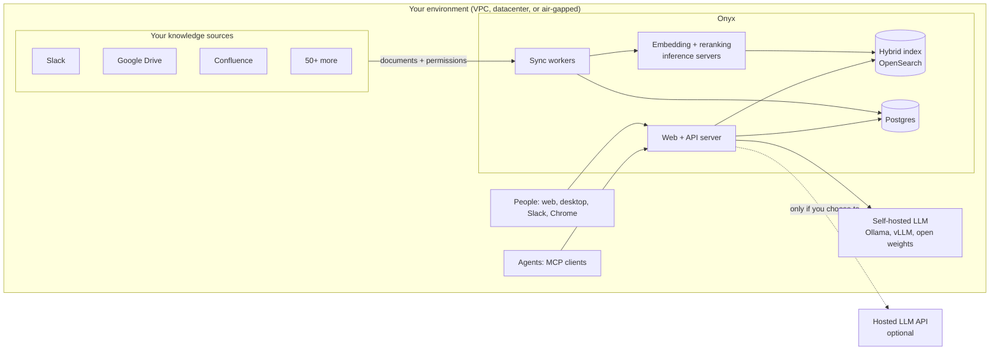

<a name="readme-top"></a>

<h2 align="center">
    <a href="https://www.onyx.app/?utm_source=onyx_repo&utm_medium=github&utm_campaign=readme"> </a>
</h2>

<p align="center">
    <a href="https://discord.gg/TDJ59cGV2X" target="_blank">
        
    </a>
    <a href="https://docs.onyx.app/?utm_source=onyx_repo&utm_medium=github&utm_campaign=readme" target="_blank">
        
    </a>
    <a href="https://www.onyx.app/?utm_source=onyx_repo&utm_medium=github&utm_campaign=readme" target="_blank">
        
    </a>
    <a href="https://github.com/onyx-dot-app/onyx/blob/main/LICENSE" target="_blank">
        
    </a>
</p>

<p align="center">
  <a href="https://trendshift.io/repositories/12516" target="_blank">
    
  </a>
</p>

<p align="center">
  <b>English</b> | <a href="./README.zh-CN.md">简体中文</a>
</p>

# Onyx

**[Onyx](https://www.onyx.app/?utm_source=onyx_repo&utm_medium=github&utm_campaign=readme)** is the AI platform that delivers complete context to your humans and agents.

> [!TIP]
> Deploy with a single command:
>
> ```
> curl -fsSL https://onyx.app/install_onyx.sh | bash
> ```


---

## What is Onyx?

Onyx is open source and runs in your own environment. You connect Slack, Google Drive, Confluence, Jira, GitHub, Salesforce, and 50+ other sources, and Onyx keeps them indexed in a hybrid keyword + vector index so it can answer questions with citations. You can reach it from the chat UI, from Slack, from a Chrome extension, or as an MCP server that feeds context to your own agents.

The reason it works better than searching each app live is that the index exists before you ask. One retrieval step replaces a chain of live searches across apps, which means fewer round trips, fewer tokens per answer, and results from the source nobody thought to check.

What ships in the box:

- **Agentic RAG.** Query rewriting and routing over the hybrid index. On [EnterpriseRAG-Bench](https://www.onyx.app/enterpriserag-bench?utm_source=onyx_repo&utm_medium=github&utm_campaign=readme), our open source 500-question benchmark, Onyx outperforms Azure AI Search, OpenAI File Search, and Vertex AI Search.
- **Deep research.** Multi-step research that produces long-form, cited reports. Top of the [leaderboard](https://github.com/onyx-dot-app/onyx_deep_research_bench) as of Feb 2026.
- **Custom agents.** Each agent gets its own instructions, knowledge, and actions.
- **Actions and MCP.** Agents can call external APIs and MCP servers.
- **Web search.** Serper, Google PSE, Brave, SearXNG, Exa, and Tavily for search, with the built-in crawler, Firecrawl, or Tavily Extract for fetching pages.
- **Code execution.** A sandbox for data analysis, charts, and file edits.
- **Artifacts, voice mode, and image generation.**

---

## Why self-host it

Every hosted enterprise AI product wants your documents and prompts in its cloud, which means you inherit its retention policy, its access controls, and its training terms. Onyx runs in your environment instead, so none of that applies.



- **Everything stays inside your boundary.** The index, the database, the embedding models, and the model traffic all run on machines you control, whether that is your cloud account, your datacenter, or an air-gapped network.
- **No content leaves.** The only outbound call Onyx makes on its own is usage telemetry: an installation UUID, version, event types, timings, and on Enterprise deployments the instance's email domain. It never includes documents or prompts, and `DISABLE_TELEMETRY=true` turns it off. Sentry and PostHog stay off unless you set their keys.
- **Any model.** Run open weights on your own GPUs through Ollama, vLLM, or LiteLLM, or connect Anthropic, OpenAI, Gemini, and others under your own keys. Onyx never proxies prompts through a third party, and you can swap providers in one click or restrict which providers each user group can use.
- **Open source.** The Community Edition is MIT licensed and lives in this repo, so your security team can read the code that touches your data, build the images themselves, and confirm there is no hidden egress.
- **Permission syncing (Enterprise Edition).** Onyx syncs document-level ACLs from Google Drive, Confluence, Jira, GitHub, Slack, SharePoint, Gmail, Outlook, Teams, Zoom, Box, and Canvas, and filters Salesforce results live at query time. Every query, whether it comes from a person or an agent, only returns documents that user can already open at the source. Syncs run every 5 to 30 minutes by default.
- **Audit (Enterprise Edition).** Query history records who asked what and which documents were cited, and [audit logging](docs/AUDIT_LOGGING.md) records logins, admin changes, and access-control changes in a format your SIEM can ingest.

---

## Use it from anywhere

The same index and the same permissions apply no matter where the question comes from.

- **Web and desktop app (macOS).** Chat, deep research, agents, and everything else in the feature list above.
- **Slackbot.** Answers land in the channels where people already ask.
- **MCP server.** Point Claude Code, Cursor, Codex, or any MCP client at Onyx, and your agents get company context with the same access controls as the person running them.
- **Chrome extension.** Query Onyx from any tab.

The full connector list is [here](https://www.onyx.app/connectors?utm_source=onyx_repo&utm_medium=github&utm_campaign=readme) and the docs are [here](https://docs.onyx.app/welcome?utm_source=onyx_repo&utm_medium=github&utm_campaign=readme).

---

## Deployment

Every option below runs the same images. Pick by how much you want to operate yourself. The full guides are at [docs.onyx.app/deployment](https://docs.onyx.app/deployment/overview).

- **Guided install (Docker Compose).** The one-liner at the top of this page installs `onyx-cli` and runs `onyx-cli deploy install`, which writes the compose files to `~/.config/onyx`, brings the stack up, and handles `upgrade`, `stop`, `logs`, and `uninstall` afterwards. Pass `--lite` for Onyx Lite. This is the right choice for a single host.
- **Docker Compose by hand.** Clone the repo, copy `deployment/docker_compose/env.template` to `.env`, and run `docker compose up -d` from that directory. Add `-f docker-compose.onyx-lite.yml` for Lite, or `docker-compose.prod.yml` for TLS via Let's Encrypt behind nginx.
- **Kubernetes (Helm).** `helm repo add onyx https://onyx-dot-app.github.io/onyx` then `helm install onyx onyx/onyx`. The chart is also published as an OCI artifact at `ghcr.io/onyx-dot-app/charts/onyx`. Use this for multi-node or autoscaled deployments.
- **Terraform.** Modules for AWS and Azure under `deployment/terraform/modules`, plus a CloudFormation template for AWS ECS Fargate.

### Standard vs Lite

**Standard** is the full platform and what the compose file starts by default. It runs the API server and Next.js web server behind nginx, a Celery background worker for connector syncs and permission syncs, OpenSearch for the hybrid keyword + vector index, two model servers (one for indexing embeddings, one for query-time embedding and reranking), Postgres, Redis for caching and auth state, and MinIO for file storage. You want this for anything involving connectors or RAG.

**Lite** is the same API server and web UI over Postgres alone. The overlay moves OpenSearch, Redis, MinIO, both model servers, and the background worker into Compose profiles so they do not start, and points caching, auth, and file storage at Postgres. Connectors and RAG search are off in this mode. Chat with any LLM, tools, custom agents, projects, user file uploads, and code execution still work, and the whole stack fits in under 1GB of memory. Individual services come back with `--profile opensearch`, `--profile redis`, and so on when you need them.

> [!TIP]
> **To try Onyx without deploying anything, sign up for [Onyx Cloud](https://cloud.onyx.app/auth/signup?utm_source=onyx_repo&utm_medium=github&utm_campaign=readme)**.

---

## Licensing

The **Community Edition (CE)** is MIT licensed and covers chat, RAG, agents, and actions. The **Enterprise Edition (EE)** adds SSO (Google OAuth, OIDC, SAML, and SCIM provisioning), RBAC, permission syncing, custom code hooks, analytics and query history, whitelabeling, and SOC 2 Type II. Details are on the [pricing page](https://www.onyx.app/pricing?utm_source=onyx_repo&utm_medium=github&utm_campaign=readme).

## Community

Join us on **[Discord](https://discord.gg/TDJ59cGV2X)**.

## Contributing

See the [Contribution Guide](CONTRIBUTING.md).
