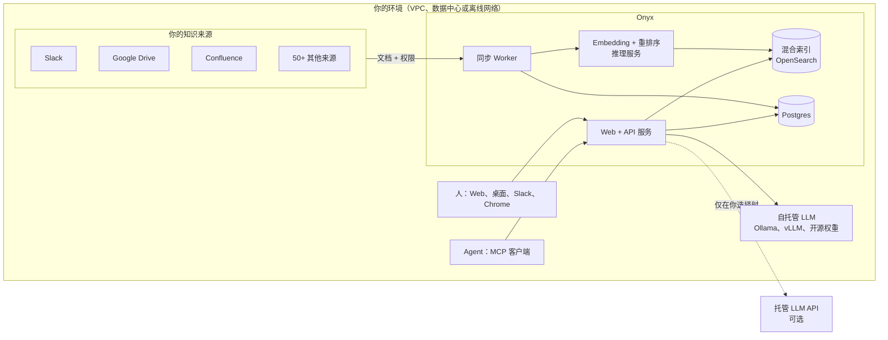

<a name="readme-top"></a>

<h2 align="center">
    <a href="https://www.onyx.app/?utm_source=onyx_repo&utm_medium=github&utm_campaign=readme"> </a>
</h2>

<p align="center">
    <a href="https://discord.gg/TDJ59cGV2X" target="_blank">
        
    </a>
    <a href="https://docs.onyx.app/?utm_source=onyx_repo&utm_medium=github&utm_campaign=readme" target="_blank">
        
    </a>
    <a href="https://www.onyx.app/?utm_source=onyx_repo&utm_medium=github&utm_campaign=readme" target="_blank">
        
    </a>
    <a href="https://github.com/onyx-dot-app/onyx/blob/main/LICENSE" target="_blank">
        
    </a>
</p>

<p align="center">
  <a href="https://trendshift.io/repositories/12516" target="_blank">
    
  </a>
</p>

<p align="center">
  <a href="./README.md">English</a> | <b>简体中文</b>
</p>

# Onyx：为你的员工和 Agent 提供完整上下文

**[Onyx](https://www.onyx.app/?utm_source=onyx_repo&utm_medium=github&utm_campaign=readme)** 从企业知识库中为你的员工和 Agent 提供最佳上下文，数据全程不离开你的环境。

> [!TIP]
> 一键部署：
>
> ```
> curl -fsSL https://onyx.app/install_onyx.sh | bash
> ```


---

## Onyx 是什么？

Onyx 连接你公司已经在用的工具（Slack、Google Drive、Confluence、Jira、GitHub、Salesforce 以及 50+ 其他来源），持续建立索引，并带引用地回答问题。同一套上下文既服务于聊天中的人，也通过 MCP 服务于 Agent。

大多数 AI 工具一次只搜索一个应用，把最先返回的结果直接交给模型。Onyx 则预先索引全部内容，把你的问题改写成多种形式发出，再从所有相关来源中拼出完整答案。这就是"没有明显异常"与"多出的 4 万美元是 PR #2213 里没人拆掉的 perf-test 集群"之间的区别。

由于上下文来自预建的混合索引，而不是一连串实时应用搜索，答案更快，消耗的 token 也更少。

搜索质量是实测的，不是口头承诺：

- 在 [EnterpriseRAG-Bench](https://www.onyx.app/enterpriserag-bench?utm_source=onyx_repo&utm_medium=github&utm_campaign=readme) 上（我们的开源基准，基于真实工作数据的 500 个问题），Onyx 优于 Azure AI Search、OpenAI File Search 和 Vertex AI Search。
- 在 22 万份内部文档上的 99 个真实工作问题中，由两个独立 LLM 评审盲评，Onyx 在与主流企业 AI 产品的[正面对比](https://www.onyx.app/answers?utm_source=onyx_repo&utm_medium=github&utm_campaign=readme)中胜出。

---

## Onyx 为什么最安全？我为什么要在意？

每一款企业 AI 产品都要求你把文档、向量和提示词发送到别人的云上。一旦如此，你就在信任供应商的数据保留策略、供应商的访问控制和供应商的训练条款。Onyx 把"供应商"从这句话里去掉了。

### Onyx 完全运行在你的环境中

把 Onyx 部署在你自己的云账户、你自己的数据中心，或完全离线（air-gapped）的环境中。每一个组件都运行在你的安全团队已经掌控的边界之内。没有任何回传。



这在实践中意味着：

- **文档和向量留在你的基础设施中。** 索引、数据库和 embedding 模型全部运行在你控制的机器上。
- **任何人都不会用你的数据训练，永远不会。** 链路中没有任何 Onyx 云服务可以保留或学习你的内容。
- **模型流量由你决定。** 把 Onyx 指向自托管模型，就没有任何 token 离开你的网络。或者用你自己的合同和密钥接入托管 API 提供商。无论哪种方式，Onyx 都不会把你的提示词经由第三方代理。
- **一切可审计。** 查询历史和[审计日志](docs/AUDIT_LOGGING.md)记录谁问了什么，以及回答时使用了哪些文档。

### 开源

完整的社区版采用 MIT 许可证，代码就在本仓库中。你的安全团队可以阅读所有接触你数据的代码，自行构建镜像，并验证没有隐藏的外发流量。本页的任何说法你都不必只听我们的。

### 任意模型

Onyx 不绑定任何模型供应商。通过 Ollama、vLLM 或 LiteLLM 在自己的 GPU 上运行开源权重。用你自己的账户接入 Anthropic、OpenAI、Gemini 或任何其他提供商。一键切换供应商，或为每个团队路由到不同的模型。当更好的模型发布，或你的合规要求变化时，你无需重新搭建平台。

### 权限同步

只有尊重来源系统既有权限的搜索才是安全的。Onyx 从 Google Drive、Confluence、Jira、GitHub、Slack、SharePoint、Salesforce、Gmail、Outlook、Teams、Box 和 Canvas 同步文档级访问控制。当人或 Agent 提问时，Onyx 只检索该用户在来源系统中有权查看的文档。权限在查询时校验，所以昨天共享、今天撤销的文档，今天的答案中就不会出现。

在来源权限之上，企业版还提供：

- **单点登录：** Google OAuth、OIDC 或 SAML。通过 SCIM 同步用户组并进行用户配置。
- **基于角色的访问控制：** 对 Agent、Action、connector 等敏感资源进行 RBAC。
- **自定义代码钩子：** 剔除 PII、拒绝敏感查询，或对每个请求运行你自己的检查。
- **分析和查询历史：** 按团队、模型或 Agent 拆分的用量统计，以及用于审计的完整记录。
- **SOC 2 Type II** 认证。

---

## 如何使用这些上下文

### Onyx 无处不在

同一套索引、同一套权限，在工作发生的任何地方：

- **Web 和桌面应用：** 聊天、深度研究、自定义 Agent、Artifact、代码执行、语音和图像生成。
- **Slackbot：** 在问题本来就会被提出的频道里直接提问和回答。
- **MCP：** 把 Onyx 知识暴露给 Claude Code、Cursor、Codex 或任何 MCP 客户端，让你的编码和工作流 Agent 获得企业上下文，且访问控制与运行它的人完全一致。
- **Chrome 扩展：** 在任意标签页中查询 Onyx。

### 功能特性

- **Agentic RAG：** 覆盖所有来源的关键词 + 向量混合索引，配合改写和路由查询的 Agent。
- **深度研究：** 多步研究流程，生成带引用的长篇报告。截至 2026 年 2 月位居[排行榜](https://github.com/onyx-dot-app/onyx_deep_research_bench)榜首。
- **自定义 Agent：** 构建拥有专属指令、知识和 Action 的 Agent。
- **Action 与 MCP：** 让 Agent 调用外部应用，支持灵活的认证方式。
- **Web 搜索：** Serper、Google PSE、Brave、SearXNG 等。内置自研爬虫，并支持 Firecrawl 和 Exa。
- **代码执行：** 在沙箱中运行代码，用于分析数据、绘制图表或编辑文件。
- **Artifact：** 生成文档、图形及其他可下载文件。
- **语音模式：** 语音转文字与文字转语音。
- **图像生成：** 根据提示词生成图像。

完整 connector 列表见[此处](https://www.onyx.app/connectors?utm_source=onyx_repo&utm_medium=github&utm_campaign=readme)。了解更多请查看[文档](https://docs.onyx.app/welcome?utm_source=onyx_repo&utm_medium=github&utm_campaign=readme)。

---

## 部署

Onyx 支持 Docker Compose、Kubernetes（Helm）和 Terraform，并提供 AWS、GCP 和 Azure 的部署指南。详细指南见[此处](https://docs.onyx.app/deployment/overview)。

有两种部署选项：Lite 和 Standard。

#### Onyx Lite

轻量级聊天 UI。内存占用不到 1GB，技术栈更精简。适合快速试用 Onyx，或只需要聊天和 Agent 功能的团队。

#### Standard Onyx

完整功能集，推荐大型团队使用。在 Lite 的基础上增加：

- 用于 RAG 的向量 + 关键词索引。
- 从 connector 同步知识和权限的后台 Worker。
- 索引和搜索时使用的 embedding 与重排序模型推理服务。
- 面向大规模使用的 Redis 缓存和 MinIO 对象存储。

> [!TIP]
> **想不部署直接体验 Onyx，请访问 [Onyx Cloud](https://cloud.onyx.app/signup?utm_source=onyx_repo&utm_medium=github&utm_campaign=readme)**。

---

## 许可证

Onyx 有两个版本：

- Onyx 社区版（CE）基于 MIT 许可证免费提供，涵盖聊天、RAG、Agent 和 Action 的全部核心功能。
- Onyx 企业版（EE）增加主要面向大型组织的功能，包括 SSO、RBAC、权限同步和白标。

功能详情见[我们的网站](https://www.onyx.app/pricing?utm_source=onyx_repo&utm_medium=github&utm_campaign=readme)。

## 社区

加入我们的开源社区 **[Discord](https://discord.gg/TDJ59cGV2X)**！

## 贡献

想要贡献代码？请查看[贡献指南](CONTRIBUTING.md)。
